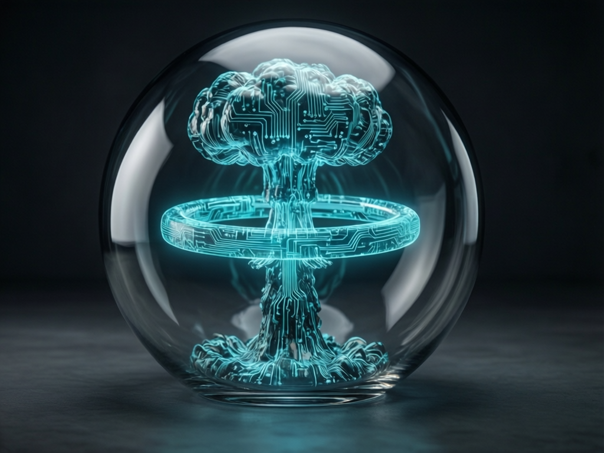

<p align="center">
  
</p>

```text
 _______________________________________________________
/                                                       \
|  WARNING: UNAUTHORIZED ACCESS TO THIS TERMINAL WILL   |
|  RESULT IN IMMEDIATE COGNITIVE REDACTION.             |
\_______________________________________________________/
       \   ^__^
        \  (oo)\_______
           (__)\       )\/\
               ||----w |
               ||     ||
```

# [TOP SECRET // NOFORN] PROPAGANDA_NUKE (v1.5.0-GHOST)

**OPERATIONAL DIRECTIVE**: BURN IT ALL DOWN.
**THREAT LEVEL**: CRITICAL (THE ALGORITHM IS BREACHING THE PERIMETER)
**IDENT**: 0xDEADC0DE
**ENCRYPTION**: MULTIPLE-LAYERS-OF-PARANOIA

---

## // EXECUTIVE SUMMARY

The "Information Superhighway" is a radioactive wasteland. They aren't articles; they are **weaponized cognitive payloads** designed to harvest your outrage and sell your anxiety to the highest bidder. 

`propaganda_nuke` is not a filter. It is a **thermonuclear first strike** against the engagement economy. We don't fact-check. We drop a payload of friction directly onto the limbic system.

---

## // ARSENAL & ORDNANCE

| WEAPON SYSTEM | DESIGNATION | DAMAGE REPORT |
| :--- | :--- | :--- |
| **RAD_SHIELD** | `SCORCHED_EARTH_NET` | Obliterates exfiltration pixels. Sanitizes tracking parameters (`fbclid`, `utm_*`) with extreme prejudice. |
| **SEMANTIC_NUKE** | `FEAR_EATER_3.0` | Sniffs out high-velocity "Sentiment Bombs" and aggressively censors them for your mental survival. |
| **FRICTION_GATE** | `THE_WAITING_ROOM` | Slaps a 12,000ms latency on known doomscrolling traps. Breathe. |
| **DECAY_OS** | `VISUAL_TOXICITY` | UI physically rots, jitters, and bleeds neon colors as the page's propaganda density spikes. |
| **FORENSIC_VAULT** | `THE_BLACK_BOX` | Immutable, signed logging of every bullet dodged. |

---

## // ARMING SEQUENCE [DEV_MODE]

You want the launch codes? Fine.

1. Clone this repository into your underground bunker.
2. Breach your browser's security mainframe (`chrome://extensions`).
3. Rip the duct tape off **Developer mode**.
4. Punch **Load unpacked** and select the `propaganda_nuke` directory.
5. Pray.

---

## // RULES OF ENGAGEMENT

*   **PEACE WAS NEVER AN OPTION**: The nuke triggers automatically when outrage saturation exceeds `CRITICAL_MASS`.
*   **COLLATERAL DAMAGE**: Execution of these protocols will result in irreversible DOM destruction. If you wanted a pretty UI, you're in the wrong foxhole.
*   **THE RED BUTTON (Bypass)**: You can override the blast doors, but we're logging it. The Black Box remembers your weakness. 

---

## // UPCOMING ORDNANCE

*   [ ] **Geiger Audio**: Auditory clicking as the radiation spikes. (Because why not induce panic while fighting panic?)
*   [ ] **Social Sector Lockdown**: Hardening the perimeter against Infinite Scroll algorithms.
*   [ ] **Intel SitRep**: A daily readout of how much of your brain we saved today.

---

## // FINAL WARNING

Deploying `propaganda_nuke` is an act of digital hostility. It is opinionated, sardonic, and gives zero cares about "narrative fidelity." It exists only to defend the sovereign borders of your prefrontal cortex.

**[SYSTEM STATUS: ARMED]**
**[LICENSE: MIT // DO_NOT_COMPLY]**